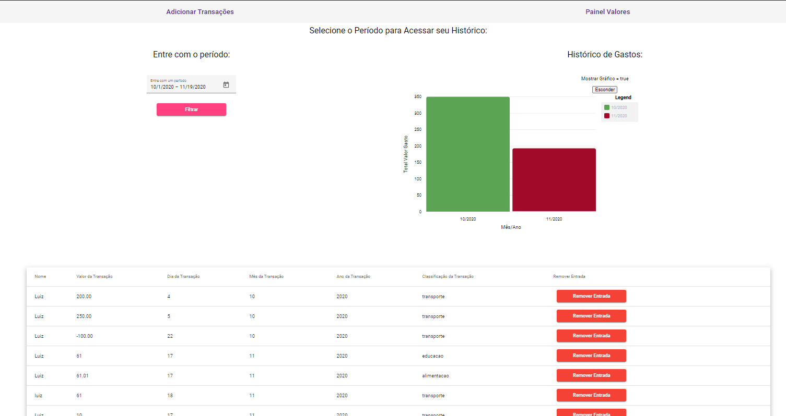

# Desafio de Construção de uma SPA em Angular 

- Este projeto é requisito necessário para conclusão do bootcamp Aceleração Global Dev#2 da Digital Innovation One (https://digitalinnovation.one/). 

- Nele fomos desafiados a construir uma Single Page Application em Angular 2.

- Este projeto implementa um Gerenciador Financeiro capaz de armazenar e editar o histórico 
financeiro de um usuario 

#  Dependência: 

- Para iniciar o banco de dados: 
```
- Navegar até a pasta assets 
cd / src/assets 
- Inicializar o json-server no arquivo db2.json
json-server --watch db2.json
```


- Este projeto usa conceitos de: 

- Angular 2 
- Angular Material 
- Construção de Single Page Applications 
- Criação de componentes usando o AngularCli
- Data-Binding 
- Diretivas 
- EventEmitters 
- LifeCicleHooks 
- Observables

Objetivos: 

- Criar no mínimo 3 componentes interagindo na mesma página
- 4 componentes de Angular Material 
- Uma interação usando property binding 
- Explicação em vídeo postado no youtube : 
- utilizamos a diretiva *ngIf para mostrar o grafico apenas quando o usuário selecionar 


# Procedimentos : 

- Criei uma SPA em Angular , que utiliza diversos componentes angular material como :
- matInput
- matDatepicker
- mat-raised-button
- Utilizamos Observable para o retorno das consultar HTTP 
- Utilizamos o lifeCicleHook ngOnInit para receber as transações via HTTP 
- utilizamos Data-Binding através do método dateInput para mostrar o valor da data ao mesmo tempo que o usuário a seleciona 


# Documentação do Ng New

This project was generated with [Angular CLI](https://github.com/angular/angular-cli) version 10.2.0.

## Development server

Run `ng serve` for a dev server. Navigate to `http://localhost:4200/`. The app will automatically reload if you change any of the source files.

## Code scaffolding

Run `ng generate component component-name` to generate a new component. You can also use `ng generate directive|pipe|service|class|guard|interface|enum|module`.

## Build

Run `ng build` to build the project. The build artifacts will be stored in the `dist/` directory. Use the `--prod` flag for a production build.

## Running unit tests

Run `ng test` to execute the unit tests via [Karma](https://karma-runner.github.io).

## Running end-to-end tests

Run `ng e2e` to execute the end-to-end tests via [Protractor](http://www.protractortest.org/).

## Further help

To get more help on the Angular CLI use `ng help` or go check out the [Angular CLI Overview and Command Reference](https://angular.io/cli) page.
